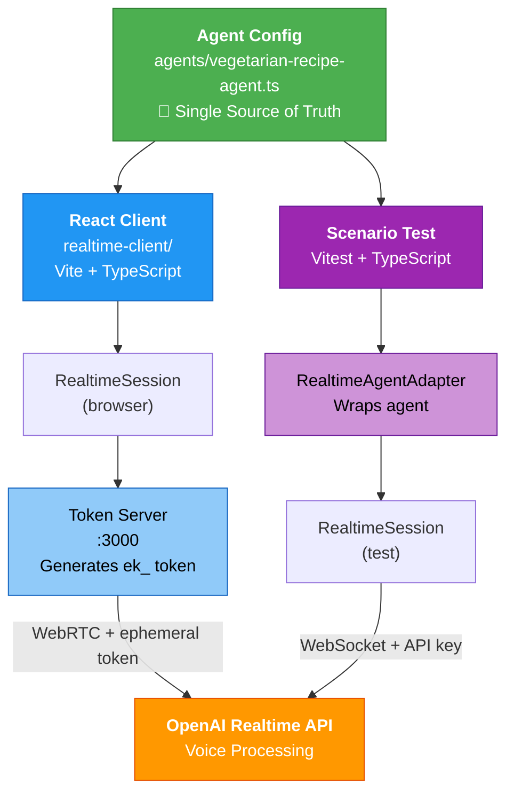

# Realtime Voice Agent

This example demonstrates how to create and test a **voice-enabled AI agent** using OpenAI's Realtime API, with **one source of truth** for the agent configuration.

## 🎯 What's Included

- **Agent Config** (`agents/vegetarian-recipe-agent.ts`) - **TypeScript single source of truth**
- **React Browser Client** (`realtime-client/`) - TypeScript, Vite, shadcn/ui components
- **Scenario Test** (planned) - Will use shared TypeScript config
- **Ephemeral Token Server** (`realtime-client/src/server/`) - Securely generate client tokens

## ✅ Key Principle: Same Session Creation, Accurate Testing

```typescript
// agents/vegetarian-recipe-agent.ts - ONE source of truth (TypeScript!)
export function createVegetarianRecipeSession(): RealtimeSession { ... }

// realtime-client/src/App.tsx - Browser uses it (via Vite)
import { createVegetarianRecipeSession } from '../../agents/vegetarian-recipe-agent';
const session = createVegetarianRecipeSession();
await session.connect({ apiKey: ephemeralToken });

// test.ts - Tests use it (via Vitest)
import { createVegetarianRecipeSession } from './realtime/agents/vegetarian-recipe-agent';
const session = createVegetarianRecipeSession();
await session.connect({ apiKey: process.env.OPENAI_API_KEY });
const adapter = new RealtimeAgentAdapter({ session, role: AgentRole.AGENT, agentName: "..." });

// ✅ SAME session creation = accurate testing!
```

## 🎨 Why Vite?

- ✅ TypeScript works natively (no build step during dev)
- ✅ Hot module replacement (instant updates)
- ✅ Proper module resolution
- ✅ Same imports in browser and tests
- ✅ Modern, fast, standard

## 🚀 Quick Start

### 1. Install Dependencies

```bash
cd javascript/examples/vitest
pnpm install
```

### 2. Set Your OpenAI API Key

Create a `.env` file:

```bash
echo "OPENAI_API_KEY=sk-proj-..." > .env
```

### 3. Start Everything (ONE COMMAND!)

```bash
pnpm realtime
```

This starts:

- 🔵 Token server on port 3000
- 🟣 Vite client on port 5173 (auto-opens browser)

Click "Connect" and start talking!

### 4. Run the Tests (Optional, separate terminal)

```bash
pnpm test vegetarian-recipe-realtime
```

Tests the **EXACT same TypeScript agent** that the browser uses!

## 🗣️ Try These Prompts

- "What's a quick pasta recipe?"
- "Give me ideas for a healthy lunch"
- "How do I make a vegetable stir-fry?"
- "I need a recipe using chickpeas"

## 🏗️ Architecture

```
                  ┌──────────────────────────────┐
                  │     Agent Config (TS!)       │  ← SINGLE SOURCE OF TRUTH
                  │  agents/vegetarian-recipe-   │
                  │         agent.ts             │
                  └──────┬──────────┬────────────┘
                         │          │
          ┌──────────────┘          └───────────────┐
          │                                          │
          ↓                                          ↓
┌─────────────────────┐                  ┌──────────────────────┐
│  React Client       │                  │  Scenario Test       │
│  (Vite + TS)        │                  │  (Vitest + TS)       │
│                     │                  │                      │
│  RealtimeSession    │                  │  RealtimeAdapter     │
│        ↓            │                  │  → RealtimeSession   │
│  Token Server (ek_) │                  │                      │
└─────────┬───────────┘                  └──────────┬───────────┘
          │                                         │
          │ WebRTC + ephemeral token                │ WebSocket + API key
          │                                         │
          └──────────┬────────────────────────────┬─┘
                     ↓                            ↓
          ┌──────────────────────────────────────────┐
          │      OpenAI Realtime API                 │
          │      (voice processing server)           │
          └──────────────────────────────────────────┘
```

### Visual Flow



**Key Points:**

- 🎯 **Same agent config** - Both paths use identical TypeScript module
- 🌐 **Browser** - Uses token server for security, connects via WebRTC
- 🧪 **Tests** - Uses API key directly via adapter, connects via WebSocket
- ✅ **Accurate testing** - Tests run the REAL agent, not a mock

## 📋 How It Works

### Two Paths, One Session Creator

The session creator (`agents/vegetarian-recipe-agent.ts`) is imported by both:

**Browser Client:**

1. Imports `createVegetarianRecipeSession()` function
2. Calls function to get `RealtimeSession` instance
3. Fetches ephemeral token from token server (security!)
4. Connects session to OpenAI via WebRTC with token
5. Uses session directly for all interactions

**Scenario Tests:**

1. Imports same `createVegetarianRecipeSession()` function
2. Calls function to get `RealtimeSession` instance
3. Connects session to OpenAI with API key directly
4. Passes connected session to `RealtimeAgentAdapter`
5. Adapter translates session interactions to Scenario interface

### Ephemeral Tokens (Browser Only)

The browser cannot directly use your OpenAI API key (security risk!). Instead:

1. **Browser** requests a token from **your server**
2. **Your server** calls OpenAI's `/realtime/client_secrets` endpoint
3. **OpenAI** returns an ephemeral token (starts with `ek_`)
4. **Browser** uses this token to connect via WebRTC
5. Token expires after a short time (typically 60 seconds)

**Scenario tests bypass this** - they use your API key directly, which is safe in a test environment.

### Voice Processing

The OpenAI Realtime API handles:

- **Voice Activity Detection** (VAD) - Knows when you start/stop speaking
- **Audio Processing** - Converts speech to text and back
- **Low Latency** - ~300ms round-trip via WebRTC
- **Natural Conversation** - Can be interrupted, supports back-and-forth

## 🔧 Customization

### Change the Agent Instructions

Edit **one file**: `agents/vegetarian-recipe-agent.ts`

```typescript
export const AGENT_INSTRUCTIONS = `
  YOUR NEW INSTRUCTIONS HERE
`;

// That's it! Browser and tests automatically use the new instructions.
```

### Add Tools/Functions

```typescript
// agents/vegetarian-recipe-agent.ts
export function createVegetarianRecipeSession(): RealtimeSession {
  const agent = new RealtimeAgent({
    name: AGENT_CONFIG.name,
    instructions: AGENT_CONFIG.instructions,
    voice: AGENT_CONFIG.voice,
    tools: [
      {
        type: "function",
        name: "get_recipe",
        description: "Fetch a recipe from database",
        parameters: {
          type: "object",
          properties: {
            recipeName: { type: "string" },
          },
        },
      },
    ],
  });

  return new RealtimeSession(agent, {
    model: AGENT_CONFIG.model,
  });
}
```

## 🧪 Testing with Scenario

Example test using the same session creator:

```typescript
import { createVegetarianRecipeSession } from './agents/vegetarian-recipe-agent';
import { RealtimeAgentAdapter, AgentRole } from '@langwatch/scenario';

// In beforeAll:
const session = createVegetarianRecipeSession();
await session.connect({ apiKey: process.env.OPENAI_API_KEY! });

const adapter = new RealtimeAgentAdapter({
  session,
  role: AgentRole.AGENT,
  agentName: "Vegetarian Recipe Assistant",
});

// In test:
await scenario.run({
  agents: [adapter, userSimulator],
  script: [scenario.user("quick recipe"), scenario.agent()],
});

// In afterAll:
await adapter.disconnect();
```

See `vegetarian-recipe-realtime.test.ts` for full example.

## 📚 Next Steps

- **Deployment** - Deploy the token server to production
- **Production Client** - Integrate into your React/Next.js app
- **More Agents** - Create additional agents using the same pattern

## 🔗 Resources

- [OpenAI Realtime API Docs](https://platform.openai.com/docs/guides/realtime)
- [OpenAI Agents SDK](https://openai.github.io/openai-agents-js/guides/voice-agents/quickstart/)
- [Scenario Testing Framework](https://github.com/langwatch/scenario)

## 🐛 Troubleshooting

### "Failed to fetch token"

- Ensure everything is running: `pnpm realtime` (starts both server and client)
- Check `OPENAI_API_KEY` is set in `.env`
- Token server should be on port 3000

### "Module not found" errors

- Run `pnpm install` in `javascript/examples/vitest`
- Ensure Vite dev server is running (part of `pnpm realtime`)
- Check you're navigating to http://localhost:5173 (Vite port)

### "Microphone access denied"

- Grant microphone permissions in your browser
- Try HTTPS (required by some browsers)

### "Connection failed"

- Check your network connection
- Ephemeral tokens expire quickly - reconnect if needed
- Check browser console for detailed errors

## 🎓 Learning Resources

See the inline documentation in:

- `realtime-client/src/server/ephemeral-token-server.ts` - Token generation
- `realtime-client/src/App.tsx` - React client implementation
